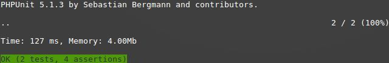
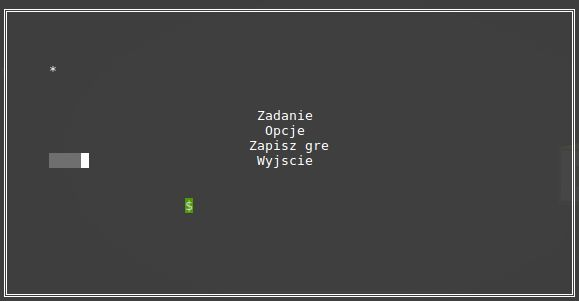
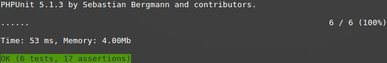

ifdef::env-github[]
:tip-caption: :bulb:
:note-caption: :information_source:
:important-caption: :heavy_exclamation_mark:
:caution-caption: :fire:
:warning-caption: :warning:
endif::[]

Piotr Góra,
Wojciech Dunia,
Marcin Jaskowski

= Snake.php

= Refaktoryzacja 1

=== Testy początkowe
Przed przystąpieniem do pracy nad projektem sprawdziliśmy działanie wbudowanych testów.

=== Przykład 1

Przed refaktoryzacją metoda writeGameOver() była wywoływana bez argumentu. Wypisywała na konsoli informację o końcu gry. Metoda to była zamknięta na zmiany. Po refaktoryzacji metoda może zostać wykorzystana do wypisania dowolnego tekstu na ekranie. Bez paramerów low i column tekst będzie automatycznie wypisywany na środku. Jeśli argumenty zostaną podanę tekst wyświetli się w określonym miejscu. Pozwoli to na wielokrotne wykorzystanie tej metody.

===== Przed refaktoryzacją 

[source,php]
----
public function writeGameOver()
    {
        $text = 'GAME OVER';
        $length = strlen($text);
        $col = ($this->width / 2) - ($length / 2);
        $row = $this->height / 2;

        for ($i = 0; $i < $length; ++$i) {
            $this->map[$row][$col] = $text[$i];
            ++$col;
        }
    }
----

===== Po refaktoryzacji 

[source,php]
----
public function writeStringOnBoard($text, $row = NULL , $column = NULL )
    {
        $length = strlen($text);
        
        if($row == NULL)
            {
                $row = $this->height / 2; <1>
            }
        if($column == NULL)
            {    
                $column = ($this->width / 2) - ($length / 2); <2>
            }
            
        for ($i = 0; $i < $length; ++$i) 
            {
                $this->map[$row][$column] = $text[$i];
                ++$column; <3>
            }
    }
----

<1> Jeżeli parametr nie zostal podany wysokosc okreslona jest jako srodkowy wiersz
<2> Jeżeli parametr nie zostal podany szerokosc okreslana jest jako srodkowa kolumna
<3> Wypisywanie testu na ekranie

[NOTE]
.Punkt kontrolny
====
Przeprowadzone testy nie wykazały błędów, przechodzimy do kolejnego etapu
====

=== Przykład 2

Dodanie menu. Przed refaktoryzacją aplikcja uwzględniała jeden tryb gry. Nie było możliwości dodawania nowych funkcjonalności. Za pomocą stworzonych klas takich jak: Menu.php, ComponentMenu.php. Umożliwiono Dodawanie dodatkowych komponentów za pomocą obieku Component menu.

===== Główna pętla programu przed refaktoryzacją

[source,php]
----
	
public function run()
     {
        try 
        {
             while (true) {                   
                 $input = $this->terminal->getChar();  <1>
                 $this->board->moveSnake($input);
                 $this->drawBoard();
                 usleep(60000);
             }
         }
         catch (GameException $exception)     <2>
         {
             $this->gameOver();
         }
     }
----
<1> Glowna petla gry
<2> Obsluga wyjatkow 

===== Główna pętla programu po refaktoryzacji

[source,php]
----
public function run()
    {
        try 
        {
              system('clear');
                    
              $menu = new Menu($this->board, $this->terminal); <1>
              $menu ->addComponentMenu(new MenuComponent('Zadanie','startGame'));  <2>
              $menu ->addComponentMenu(new MenuComponent('Opcje','newTextSide'));
              $menu ->addComponentMenu(new MenuComponent('Zapisz gre','newTextSide'));
              $menu ->addComponentMenu(new MenuComponent('Wyjscie','endGame'));
                    
              $menu ->drawMenu(); 
              
              $this->drawBoard(); 
                    
                while(true)
                    {
                        $input = $this->terminal->getChar(); 
                    
                        if($input != NULL)
                        {
                            $menu->interactWithMenu($input); <3>
                        }    
                    }
            }
         catch (GameException $exception)
         {
            $this->gameOver();
            $this->board->removeBoard();
        }
    }
----
<1> Obiekt menu posiadajacy metody tworzace widok menu
<2> Wywolanie metody dodajacej nowy komponent menu
<3> Funkcja wykorzystujaca jako parametr odczytany z klawiatury znak

===== Klasa MenuComponent.php(dziedziczy po interfejsie MenuComponentInterface.php)

[source,php]
----
class MenuComponent extends MenuComponentInterface
{
    
    ...
    
	public function __construct(string $name, string   $functionName)
    {
    	    $this->name = $name;
            $this->functionName = $functionName;
    }

    ...

}
----

===== Klasa Menu.php

[source,php]
----
class Menu
{

    ...    
        
    public function addComponentMenu(MenuComponentInterface $menuComponent)
    {
       $this->menuComponentsArray[]=['name'=> $menuComponent->getName(), 
                                     'key'=>$this->computeKeyComponentMenuValue(),
                                     'functionName' => $menuComponent->getfunctionName()];
        
    }
    
    ...
    
}
----
Dodawanie nowego opcji w menu do tablicy komponentów menu

[source,php]
----
class Menu
{

    ...    
        
    public function drawMenu()
    {
       
        foreach ($this->menuComponentsArray as $oneComponent)
        {
            $this->positionMenu($oneComponent);
        }
        
    }
    
    ...
    
}
----
Wypisanie wszystkich komponentow menu w konsoli.

[source,php]
----
class Menu
{

    ...    
        
    public function interactWithMenu($char)
    {   
        
        foreach ($this->menuComponentsArray as $oneComponent) 
        {
             if($oneComponent['key'] == $char)
             {
                
                call_user_func(array($this, $oneComponent['functionName']), $oneComponent['name']); <1>
             }
        }
    }
    

... 
    
    //Przykładowa instacja klasy MenuComponent korzystająca z funkcji "interactWithMenu()"
    // Object = new MenuComponent('Zacznij gre','startGame');
        
    ///Rozpoczecie,gry
    public function startGame() <2>
    {
        while (true)
            {
                $input = $this->terminal->getChar();
                
                $this->board->moveSnake($input);
                $this->drawer->draw($this->board);
                usleep(60000);
            }
    }
    
    ...
    
}
----
<1> Wywolanie funkcji, ktora zostala podana jako drugi parametr obiektu
<2> Przykad funkcji

Po pierwszym etapie refaktoryzacji, okno gry przedstawia się następująco:

.Wygląd menu

= Refaktoryzacja 2

Refaktoryzacja ma na celu rozszerzenie możliwości programu o dodawanie dowolnych nowych obiektów na ekranie, dziedziczących właściwości po klasie Point. Obecnie program zakłada na sztywno tworzenie jednego obiektu o nazwie Coin.

=== Stosujemy się do zasady podstawienia Liskov

na bazie metody randomCoins, która tworzy na ekranie obiekt klasy Coin:

.Board::randomCoins()
[source,php]
----
    public function randomCoins(int $count)
    {
        for ($i = 0; $i < $count; ++$i) {
            $col = rand(1, $this->width - 2);
            $row = rand(1, $this->height - 2);

            $this->coins[] = new Coin($row, $col);
        }
    }
----
tworzymy dodatkową, nową metodę, która będzie fabryką pojedynczych obiektów na planszy, oraz ostatecznie zastąpi metodę *randomCoins*. Metoda randomObjects OnBoard() będzie spełniać zasadę Liskov, dzięki czemu będzie w stanie obsłużyć dowolny obiekt dziedziczący po klasie Point. Dodajemy też zmienną instancyjną, będącą tablicą obiektów, która docelowo zastąpi tablicę $Coins:

[TIP]
.Wyjaśnienie
====
Nie chcę bezpośrednio aktualizować metody randomCoins(), gdyż wiązałoby się to z prowadzaniem zmian jednocześnie w wielu miejscach przez co nie da się wykonywać testów po każdej zmianie (linia po linii). 
====

.Board::randomObjectsOnBoard()
[source,php]
----
    /**
     * @var ObjectsOnBoard[]:array
     */
    private $ObjectsOnBoard; // <1>

    public function randomObjectsOnBoard(Point $Object, int $count) // <2>
    {
        for ($i = 0; $i < $count; ++$i) {
            $col = rand(1, $this->width - 2);
            $row = rand(1, $this->height - 2);

            $this->ObjectsOnBoard[] = $Object($row, $col); // <3>
        }
    }
----
<1> Nowa tablica obiektów zamiast dotychczasowej $coins
<2> Zamiast *randomCoins* tworzymy bardziej uniwersalną *randomObjectsOnBoard*
<3> Przypisanie obiektu do tablicy

[NOTE]
.Punkt kontrolny
====
Przeprowadzone testy nie wykazały błędów, przechodzimy do kolejnego etapu
====

=== Otwieramy się na dynamiczne parametry

w klasie Point przygotowujemy funkcję ustawiającą wstępne parametry obiektu, dzięki zastosowaniu tablicy, będzie można przekazywać specyficzne parametry, dostępne tylko dla danego typu obiektu na ekranie

.Point::setParams()
[source,php]
----
    public function setParams(array $params)
    {
        if (isset($params['row'])) $this->row = $params['row'];
        if (isset($params['col'])) $this->col = $params['col'];
        if (isset($params['char'])) $this->char = $params['char'];
    }
----

podmieniamy w konstruktorze klasy dotychczasowy sposób ustawiania parametrów:

.Point::__construct()
[source,php]
----
    public function __construct(int $row, int $col, string $char)
    {
        # $this->row = $row;
        # $this->col = $col;
        # $this->char = $char;
        $this->setParams(['row'=>$row,'col'=>$col,'char'=>$char]); // <1>
    }
----
<1> Przypisujemy parametry przez tablice, jest to zabieg potrzebny do zmiany parametów obiektu już po utworzeniu jego instancji, wcześniej nie było to możliwe

[NOTE]
.Punkt kontrolny
====
Przeprowadzamy testy i przechodzimy do kolejnego etapu
====

W metodzie generującej nowe obiekty zmieniamy sposób ustawiania losowego położenia obiektu przekazanego w parametrze

.Board::randomObjectsOnBoard()
[source,php]
----
    public function randomObjectsOnBoard(Point $Object, int $count)
    {
      for ($i = 0; $i < $count; ++$i) {
          $col = rand(1, $this->width - 2);
          $row = rand(1, $this->height - 2);
          // Losowa aktualizacja położenia obiektu na ekranie
          $Object->setParams(['col'=>$col,'row'=>$row]); //<1>
          $this->ObjectsOnBoard[] = $Object; //<2>
      }
    }
----
<1> Przypisujemy do obiektu losowe położenie
<2> Przekazany obiekt dodajemy do tablicy

W konstruktorze planszy wywołujemy nową funkcję generowania losowych obiektów na ekranie:

.Board::__construct()
[source,php]
----
    public function __construct(int $width, int $height)
    {
        $this->width = $width;
        $this->height = $height;

        $this->snake = new Snake($height, $width);

        // Stary sposób generowania obiektów
        $this->randomCoins(1);
        // Nowy sposób generowania obiektów na ekranie
        $this->randomObjectsOnBoard(new Coin(1, 2),1);

        $this->generateMap();
        $this->generateOutline();
        $this->sourceMap = $this->map;

        $this->applyElements();
    }
----

W metodzie checkCoins, również dodajemy nowy sposób generowania obiektów

.Board::checkCoins()
[source,php]
----
    private function checkCoins()
    {
        $head = $this->snake->getPoints()[0];

        if (!empty($this->Coins)) {
            foreach ($this->Coins as $index => $coin) {
                if ($head->overlaps($coin)) {
                    $this->snake->advance();
                    unset($this->Coins[$index]);
                    // Stary sposób generowania obiektów
                    $this->randomCoins(1); //<1>
                    // Nowy sposób generowania obiektów na ekranie
                    $this->randomObjectsOnBoard(new Coin(3, 4),1); //<2>
                }
            }
        }
    }
----
<1> starego sposobu na razie nie ruszamy
<2> Nowy sposób dodawania dowolnego obiektu na planszy

[NOTE]
.Punkt kontrolny
====
Przeprowadzamy testy. Ponieważ nie ma błędów, możemy przystąpić do ostatecznego etapu.
====

=== Wchodzimy na wyższy poziom abstrakcji nazw metod i zmiennych

Podmieniamy wszystkie wystąpienia dotychczasowej tablicy przechowującej obiekty na ekranie na nową

[source,php]
----
    // wszystkie
    $this->coins
    // zamieniamy na
    $this->ObjectsOnBoard
----

[NOTE]
.Punkt kontrolny
====
Błędów brak, program działa prawidłowo. Od tego momentu działanie starych motod zostało zastąpione nowo utworzonymi.
====

Pozostało zakomentowanie a następnie usunięcie niepotrzebnych metod i ich wywołań.
Na poniższym listingu widać jeszcze, że należy zrefaktoryzować nazwy nieadekwatnych metod i zmiennych w postaci checkCoins na checkObjects oraz $coin na $object

.cała klasa Board
[source,php]
----
   <?php

declare (strict_types = 1);

namespace PhpSnake\Game;

use PhpSnake\Game\Board\Coin;
use PhpSnake\Game\Board\Point;
use PhpSnake\Terminal\Char;

class Board
{
    /**
     * @var int
     */
    private $width;

    /**
     * @var int
     */
    private $height;

    /**
     * @var array
     */
    private $map;

    /**
     * @var array
     */
    private $sourceMap;

    /**
     * @var Snake
     */
    private $snake;

    /**
     * @var Coin[]:array
     */
    # private $coins; //<1>

    /**
     * @var ObjectsOnBoard[]:array
     */
    private $ObjectsOnBoard;

    /**
     * @param int $width
     * @param int $height
     */
    public function __construct(int $width, int $height)
    {
        $this->width = $width;
        $this->height = $height;

        $this->snake = new Snake($height, $width);

        // Stary sposób generowania obiektów
        # $this->randomCoins(1); //<1>
        // Nowy sposób generowania obiektów na ekranie
        $this->randomObjectsOnBoard(new Coin(1, 1),1);

        $this->generateMap();
        $this->generateOutline();
        $this->sourceMap = $this->map;

        $this->applyElements();
    }

/*    public function randomCoins(int $count)
    {
        for ($i = 0; $i < $count; ++$i) {
            $col = rand(1, $this->width - 2);
            $row = rand(1, $this->height - 2);

            $this->coins[] = new Coin($row, $col);
        }
    }*/ //<1>

    public function randomObjectsOnBoard($Object, int $count)
    {
      for ($i = 0; $i < $count; ++$i) {
          $col = rand(1, $this->width - 2);
          $row = rand(1, $this->height - 2);
          // Losowa aktualizacja położenia obiektu na ekranie
          $Object->setParams(['col'=>$col,'row'=>$row]);
          $this->ObjectsOnBoard[] = $Object;
      }
    }

    public function moveSnake(string $input)
    {
        $this->snake->move($input);
        $this->checkCoins(); //<2>
        $this->applyElements();
    }

    private function checkCoins() //<2>
    {
        $head = $this->snake->getPoints()[0];

        if (!empty($this->ObjectsOnBoard)) {
            foreach ($this->ObjectsOnBoard as $index => $coin) //<2>
            {
                if ($head->overlaps($coin)) //<2>
                {
                    $this->snake->advance();
                    unset($this->ObjectsOnBoard[$index]);
                    // Stary sposób generowania obiektów
                    # $this->randomCoins(1); // <1>
                    // Nowy sposób generowania obiektów na ekranie
                    $this->randomObjectsOnBoard(new Coin(1, 1),1);
                }
            }
        }
    }

    /**
     * @return int
     */
    public function getWidth()
    {
        return $this->width;
    }

    /**
     * @return int
     */
    public function getHeight()
    {
        return $this->height;
    }

    /**
     * @return array
     */
    public function getMap()
    {
        return $this->map;
    }

    /**Funcion writing a string on board
    *
    */
    public function writeStringOnBoard($text, $row = NULL , $column = NULL )
    {

        $length = strlen($text);

        if($row == NULL)
        {
            $row = $this->height / 2;
        }

        if($column == NULL)
        {
        $column = ($this->width / 2) - ($length / 2);
        }

        for ($i = 0; $i < $length; ++$i) {
            $this->map[$row][$column] = $text[$i];
            ++$column;
        }
    }

    /**Function clear console after 2 seconds
    *
    */
    public function removeBoard()
    {
        sleep(2);
        system('clear');
    }

    private function applyElements()
    {
        $this->map = $this->sourceMap;

        foreach ($this->snake->getPoints() as $point) {
            $this->applyPoint($point);
        }

        if (!empty($this->ObjectsOnBoard)) {
            foreach ($this->ObjectsOnBoard as $coin) //<2>
            {
                $this->applyPoint($coin); //<2>
            }
        }

    }

    /**
     * @param Point $point
     */
    private function applyPoint(point $point)
    {
        $this->map[$point->getRow()][$point->getCol()] = $point->getChar();
    }

    public function generateMap()
    {
        for ($i = 0; $i < $this->height; ++$i) {
            $this->map[$i] = array_fill(0, $this->width, ' ');
        }
    }

    public function generateOutline()
    {
        $this->map[0][0] = Char::boxTopLeft();
        $this->map[0][$this->width - 1] = Char::boxTopRight();

        $this->generateHLine(0, 1, $this->width - 2, Char::boxHorizontal());
        $this->generateHLine($this->height - 1, 1, $this->width - 2, Char::boxHorizontal());

        $this->generateVLine(0, 1, $this->height - 2, Char::boxVertical());
        $this->generateVLine($this->width - 1, 1, $this->height - 2, Char::boxVertical());

        $this->map[$this->height - 1][0] = Char::boxBottomLeft();
        $this->map[$this->height - 1][$this->width - 1] = Char::boxBottomRight();
    }

    /**
     * @param int    $row
     * @param int    $start
     * @param int    $cols
     * @param string $char
     */
    private function generateHLine(int $row, int $start, int $cols, string $char)
    {
        for ($i = 0;$i < $cols;++$i) {
            $this->map[$row][$start + $i] = $char;
        }
    }

    /**
     * @param int    $col
     * @param int    $start
     * @param int    $rows
     * @param string $char
     */
    private function generateVLine(int $col, int $start, int $rows, string $char)
    {
        for ($i = 0;$i < $rows;++$i) {
            $this->map[$start + $i][$col] = $char;
        }
    }
}

----
<1> Zastąpione i zakomentowane zmienne i metody
<2> $coin i checkCoins() - do zastąpienia nowymi nazwami

=== Testujemy otwartość na dopisanie klasy

[IMPORTANT]
.Osiągnieto ważny etap
====
Błędów brak, program jest otwarty na dopisanie klasy zeprezentującej nowy obiekt na ekranie.
====

Tworzymy nową klasę Bomb

.klasa Bomb extends Point
[source,php]
----
<?php

declare (strict_types = 1);

namespace PhpSnake\Game\Board;

class Bomb extends Point
{

    //private $arrayCoin = array("\033[41m\033[37m$\033[0m",
                               //"\033[43m\033[30m+\033[0m",
                              //  "\033[44m\033[30m#\033[0m");

    /**
     * @var string
     */
    private $char = "*";
    //private $char =  "\033[?25h\033[?0c";

     /**
     * @param int $row
     * @param int $col
     */
    public function __construct(int $row, int $col)
    {
       //$test= rand(0,2);
        parent::__construct($row, $col, $this->char);
    }
}

----

Dopisujemy wywołanie obiektu Bomb na ekranie
[source,php]
----
    public function __construct(int $width, int $height)
    {
        $this->width = $width;
        $this->height = $height;

        $this->snake = new Snake($height, $width);

        // Stary sposób generowania obiektów
        # $this->randomCoins(1);
        // Nowy sposób generowania obiektów na ekranie
        $this->randomObjectsOnBoard(new Coin(1, 2),1);
        $this->randomObjectsOnBoard(new Bomb(2, 3),1); //<1>

        $this->generateMap();
        $this->generateOutline();
        $this->sourceMap = $this->map;

        $this->applyElements();
    }
----
<1> Nowy obiekt o nowych parametrach

.Board::checkCoins()
[source,php]
----
    private function checkCoins()
    {
        $head = $this->snake->getPoints()[0];

        if (!empty($this->Coins)) {
            foreach ($this->Coins as $index => $coin) {
                if ($head->overlaps($coin)) {
                    $this->snake->advance();
                    unset($this->Coins[$index]);
                    // Nowy sposób generowania obiektów na ekranie
                    rand(0,1)==0 ? $this->randomObjectsOnBoard(new Coin(3, 4),1):$this->randomObjectsOnBoard(new Bomb(3, 4),1); //<1>
                }
            }
        }
    }
----
<1> Po "zjedzeniu" obiektu przez węża, odnawiamy losowo obiekt

.Punkt kontrolny
[NOTE]
====
Program przechodzi testy i działa prawidłowo
====

=== Code Smell (Long Parameter List)

Teraz możemy się pozbyć zbędnych parametrów w konstruktorach klas oraz zmienić przekazywane parametry na tablicę, dzięki której klasy obiektów będą otwarte na dopisywanie nowych zmiennych.

W pierwszej kolejności tworzymy parametry konstruktorów opcjonalnymi przez przypisanie im domyślnych wartości.

.Coint::__construct() i Bomb::__construct
[source,php]
----
    # public function __construct(int $row, int $col)
    public function __construct(int $row=1, int $col=1) // <1>
    {
        parent::__construct($row, $col, $this->char);
    }
----
<1> Ustawione domyślne wartości parametrów

Teraz można się pozbyć parametrów z klasy wyświetlających monety i bomby na ekranie

.Board::__construct()
[source,php]
----
    # Przed
    # $this->randomObjectsOnBoard(new Coin(1, 2),1);
    # $this->randomObjectsOnBoard(new Bomb(2, 3),1);
    # Po
    $this->randomObjectsOnBoard(new Coin(),1);
    $this->randomObjectsOnBoard(new Bomb(),1);
----

.Punkt kontrolny
[NOTE]
====
Program przechodzi testy i działa prawidłowo
====

Kolejnym krokiem jest dodanie tablicy parametrów do konstruktora klasy bazowej.
W tym kroku ustawiamy też domyślne wartości parametrów *$row*, *$col*, *$char*, ponieważ są one aktualizowane już po utworzeniu obiektu.

.Point::__construct()
[source,php]
----
    # Przed refaktoryzacją
    # public function __construct(int $row, int $col, string $char)
    # {
    #     $this->setParams(['row'=>$row,'col'=>$col,'char'=>$char]);
    # }
    
    # Po refaktoryzacji
        public function __construct(int $row=1, int $col=1, string $char='.', array $params=[])
        {
            $this->setParams(['row'=>$row,'col'=>$col,'char'=>$char]);
        }
----

.Punkt kontrolny
[NOTE]
====
Program przechodzi testy i działa prawidłowo
====

Nie możemy jeszcze pozbyć się przekazywanych parametrów, ponieważ instancja klasy Point
jest używana jako głowa i ciało dla węża w klasie Snake.

Przerabiamy konstruktor klasy Snake, aby używał nowego sposobu ustawiania parametrów wstępnie przekazywanych przez motodę *Point::setParams()*

.Snake::__construct() przed refaktoryzacją
[source,php]
----
    public function __construct(int $boardRows, int $boardCols)
    {
        $head = new Point(intval($boardRows / 2), intval($boardCols / 2), Char::block());
        $this->boardCols = $boardCols;
        $this->boardRows = $boardRows;

        for ($i = 1;$i < 5;++$i) {
            $this->points[] = new Point($head->getRow(), $head->getCol() - $i, Char::shadeBlock());
        }
        array_unshift($this->points, $head);
    }
----

.Snake::__construct() po refaktoryzacji
[source,php]
----
    public function __construct(int $boardRows, int $boardCols)
    {
        $head = new Point(); // <1>
        $head->setParams(['row' => intval($boardRows / 2), 'col' => intval($boardCols / 2), 'char' => Char::block()]);
        $this->boardCols = $boardCols;
        $this->boardRows = $boardRows;

        for ($i = 1;$i < 5;++$i) {
            $body = new Point(); // <2>
            $body->setParams(['row' => $head->getRow(), 'col' => $head->getCol() - $i, 'char' => Char::shadeBlock()]);
            $this->points[] = $body;
        }
        array_unshift($this->points, $head);
    }
----
<1> Tutaj tworzymy głowę węża, a w następnej linii ustawiamy jej parametry
<2> Tworzymy ciało węża, a w następnych liniach ustawiamy parametry i przypisujemy do tablicy

podobny zabieg trzeba zastosować w metodzie do zmiany kierunku węża

.Snake::move()
[source,php]
----
    # ...
    # fragment przed refaktoryzacją
    # $this->points[0]->setChar(Char::shadeBlock());
    # $next = new Point($row, $col, Char::block());
    
    # fragment po refaktoryzacji
    $this->points[0]->setChar(Char::shadeBlock());
    $new_point = new Point(); // <1>
    $new_point->setParams(['row'=>$row, 'col'=>$col, 'char'=>Char::block()]); // <2>
    $next = $new_point; // <3>
    # ...
----
<1> Tworzymy nowy segment węża
<2> Nadajemy mu parametry
<3> Przypisujemy do tablicy jako nowy segment

.Punkt kontrolny
[NOTE]
====
Program przechodzi testy i działa prawidłowo
====

Teraz można zmodyfikować konstruktory klas Coin i Bomb aby pozbyć się parametrów

.Bomb::__construct() i Coin::__construct() przed refaktoryzacją
[source,php]
----
    public function __construct(int $row=1, int $col=1)
    {
        parent::__construct($row, $col, $this->char);
    }
----

.Bomb::__construct() i Coin::__construct() po refaktoryzacji
[source,php]
----
    public function __construct()
    {
        parent::__construct();
        $this->setParams(['char'=>$this->char]);
    }
----

Na koniec usuwamy niepotrzebne parametry z metody klasy Point::__construct.

.Punkt kontrolny
[NOTE]
====
Program przechodzi testy i działa prawidłowo
====

.Wnioski końcowe z Refaktoryzacji nr 2
[TIP]
====
Dzięki przeprowadzonej refaktoryzacji możemy dodać dowolny nowy obiekt na ekranie, posiadający inne właściwości. Rozbudowy możemy dokonać przez dopisanie kodu klasy dziedziczącej po Point, a nie przez zmianę istniejącego kodu. Przed refaktoryzacją program był zamknięty na tego typu zmianę.
====

= Refaktoryzacja 3

.Snake::__construct() Przed zmianami
[source,php]
----
    public function __construct(int $boardRows, int $boardCols)
    {
    	$head = new Point();
    	$head->setParams(['row' => intval($boardRows / 2), 'col' => intval($boardCols / 2), 'char' => Char::block()]);
    	$this->boardCols = $boardCols;
    	$this->boardRows = $boardRows;
    	
    	for ($i = 1;$i < 5;++$i) {
    		$body = new Point();
    		$body->setParams(['row' => $head->getRow(), 'col' => $head->getCol() - $i, 'char' => Char::shadeBlock()]);
    		$this->points[] = $body;
    	}
    	array_unshift($this->points, $head);
    }
----

.Snake::__construct() Po zmianach
[source,php]
----
    private $up;

    private $down;

    private $left;

    private $right; // <1>

    /**
     * @param int $boardRows
     * @param int $boardCols
     */
    public function __construct(int $boardRows, int $boardCols, int $start_row=10, int $start_col=10, array $control=['up'=>'w','down'=>'s','left'=>'a','right'=>'d']) // <2>
    {
      // Przypisanie sterowania
      $this->up = $control['up'];
      $this->down = $control['down'];
      $this->left = $control['left'];
      $this->right = $control['right']; // <3>

    	$head = new Point();
    	$head->setParams(['row' => intval($start_row), 'col' => intval($start_col), 'char' => Char::block()]); // <4>
    	$this->boardCols = $boardCols;
    	$this->boardRows = $boardRows;

    	for ($i = 1;$i < 5;++$i) {
    		$body = new Point();
    		$body->setParams(['row' => $head->getRow(), 'col' => $head->getCol() - $i, 'char' => Char::shadeBlock()]);
    		$this->points[] = $body;
    	}
    	array_unshift($this->points, $head);
    }
----
<1> Deklaracja zmiennych dla klawiszy sterujących
<2> Ustawienie domyślnych parametrów, pozycji początkowej i tablicy klawiszy sterujących
<3> Przypisanie klawiszy do zmiennych instancyjnych
<4> Początkowa pozycja węża na ekranie

.Punkt kontrolny
[NOTE]
====
Program przechodzi testy i działa prawidłowo
====

W następnym kroku sprawdzamy jaki klawisz został wciśnięty, porównując ze zdefiniowanymi klawiszami dla obiektu Snake

.Snake::changeDirection Przed zmianami
[source,php]
----
    private function changeDirection(string $input)
    {
        if ('w' === $input && $this->direction != Direction::DOWN) {
            $this->direction = Direction::UP;
        } elseif ('a' === $input && $this->direction != Direction::RIGHT) {
            $this->direction = Direction::LEFT;
        } elseif ('s' === $input && $this->direction != Direction::UP) {
            $this->direction = Direction::DOWN;
        } elseif ('d' === $input && $this->direction != Direction::LEFT) {
            $this->direction = Direction::RIGHT;
        }
    }
----

.Snake::changeDirection po zmianach
[source,php]
----
    private function changeDirection(string $input)
    {
    	if ($this->up === $input && $this->direction != Direction::DOWN) {
    		$this->direction = Direction::UP;
    	} elseif ($this->left === $input && $this->direction != Direction::RIGHT) {
    		$this->direction = Direction::LEFT;
    	} elseif ($this->down === $input && $this->direction != Direction::UP) {
    		$this->direction = Direction::DOWN;
    	} elseif ($this->right === $input && $this->direction != Direction::LEFT) {
    		$this->direction = Direction::RIGHT;
    	}
    }
----

.Punkt kontrolny
[NOTE]
====
Program przechodzi testy i działa prawidłowo
====

=== Polimorfizm węża

Teraz można przystąpić do zmiany kodu, po którym będziemy mogli tworzyć dowolną liczbę instanji klasy Snake o różnych właściwościach, które zostaną obsłużone przez pozostałe klasy.

.Zmiany w Board::__construct
[source,php]
----
    public function __construct(int $width, int $height)
    {
        $this->width = $width;
        $this->height = $height;

        // Przed
        // $this->snake = new Snake($height, $width); // <1>
        // Po refaktoryzacji
        $this->snake[] = new Snake($height, $width); // <2>

        // Nowy sposób generowania obiektów na ekranie
        $this->randomObjectsOnBoard(new Coin(),1);
        $this->randomObjectsOnBoard(new Bomb(),1);

        $this->generateMap();
        $this->generateOutline();
        $this->sourceMap = $this->map;

        $this->applyElements();
    }
----
<1> Utworzenie pojedynczego obiektu
<2> Utworzenie kolekcji obiektów w tablicy

Teraz poprawiamy obsługę poruszania węży, aby obsługiwać wszystkie instancje

.Board::moveSnake() przed zmianami
[source,php]
----
    public function moveSnake(string $input)
    {
        $this->snake->move($input);
        $this->checkObjects();
        $this->applyElements();
    }
----

.Board::moveSnake() po zmianach
[source,php]
----
    public function moveSnake(string $input)
    {
        foreach ($this->snake as $snake) // <1>
        {
            $snake->move($input);
            $this->checkObjects();
            $this->applyElements();
        }
    }
----
<1> Wykonujemy w pętli operacje na wszystkich obiektach

.Board::checkObjects() przed zmianami
[source,php]
----
    private function checkObjects()
    {
        $head = $this->snake->getPoints()[0];

        if (!empty($this->ObjectsOnBoard)) {
            foreach ($this->ObjectsOnBoard as $index => $object) {
                if ($head->overlaps($object)) {
                    $this->snake->advance();
                    unset($this->ObjectsOnBoard[$index]);
                    // Nowy sposób generowania obiektów na ekranie
                    rand(0,1)==0 ? $this->randomObjectsOnBoard(new Coin(),1):$this->randomObjectsOnBoard(new Bomb(),1);
                }
            }
        }
    }
----

.Board::checkObjects() przed zmianami
[source,php]
----
    private function checkObjects()
    {
        foreach ($this->snake as $snake) // <1>
        {
            $head = $snake->getPoints()[0]; // <2>

            if (!empty($this->ObjectsOnBoard)) {
                foreach ($this->ObjectsOnBoard as $index => $object) {
                    if ($head->overlaps($object)) {
                        $snake->advance(); // <3>
                        unset($this->ObjectsOnBoard[$index]);
                        // Nowy sposób generowania obiektów na ekranie
                        rand(0,1)==0 ? $this->randomObjectsOnBoard(new Coin(),1):$this->randomObjectsOnBoard(new Bomb(),1);
                    }
                }
            }
        }
    }
----
<1> Wykonujemy w pętli operacje na wszystkich obiektach
<2> odwołujemy się do $snake zamiast $this->snake
<3> odwołujemy się do $snake zamiast $this->snake

Poniżej analogiczne działanie:

.Board::aplyElements() przed zmianami
[source,php]
----
    private function applyElements()
    {
        $this->map = $this->sourceMap;

        foreach ($this->snake->getPoints() as $point) {
            $this->applyPoint($point);
        }

        if (!empty($this->ObjectsOnBoard)) {
            foreach ($this->ObjectsOnBoard as $object) {
                $this->applyPoint($object);
            }
        }
    }
----

.Board::aplyElements() po zmianach
[source,php]
----
    private function applyElements()
    {
        $this->map = $this->sourceMap;

        foreach ($this->snake as $snake) // <1>
        {
            foreach ($snake->getPoints() as $point) { // <3>
                $this->applyPoint($point);
            }
        }

        if (!empty($this->ObjectsOnBoard)) {
            foreach ($this->ObjectsOnBoard as $object) {
                $this->applyPoint($object);
            }
        }
    }
----
<1> Wykonujemy w pętli operacje na wszystkich obiektach
<2> odwołujemy się do $snake zamiast $this->snake

.Punkt kontrolny
[NOTE]
====
Program przechodzi testy i działa prawidłowo
====

=== Zamykamy klasę węża na modyfikacje

Ostatni etap przygotowuje bzpośrednio do otwarcia na dopisywanie nowych instancji klasy Snake. W parametrach konstruktora planszy będziemy przekazywać kolekcję obiektów Snake.

.Board::__construct() przed zmianami
[source,php]
----
    public function __construct(int $width, int $height)
    {
        $this->width = $width;
        $this->height = $height;

        $this->snake[] = new Snake($height, $width);

        // Nowy sposób generowania obiektów na ekranie
        $this->randomObjectsOnBoard(new Coin(),1);
        $this->randomObjectsOnBoard(new Bomb(),1);

        $this->generateMap();
        $this->generateOutline();
        $this->sourceMap = $this->map;

        $this->applyElements();
    }
----

.Board::__construct() po zmianach
[source,php]
----
    public function __construct(int $width, int $height, array $snake) // <1>
    {
        $this->width = $width;
        $this->height = $height;

        $this->snake = $snake; // <2>

        // Nowy sposób generowania obiektów na ekranie
        $this->randomObjectsOnBoard(new Coin(),1);
        $this->randomObjectsOnBoard(new Bomb(),1);

        $this->generateMap();
        $this->generateOutline();
        $this->sourceMap = $this->map;

        $this->applyElements();
    }
----
<1> Przekazanie kolekcji obiektów w tablicy
<2> Utworzenie referencji w zmiennej instancyjnej

=== Otwartość na dopisanie kodu

[IMPORTANT]
.Osiągnieto ważny etap
====
Błędów brak, program jest otwarty na dopisanie i utworzenie kolekcji obiektów Snake a następnie przekazanie ich w parametrach do obiektu klasy Board.
====

.Game::__construct() przed zmianami
[source,php]
----
    public function __construct()
    {
        $this->terminal = new Terminal();
        $this->board = new Board(intval($this->terminal->getWidth() * .7), 20);
        $this->drawer = new Drawer(STDOUT);
    }
----

.Game::__construct() po zmianach
[source,php]
----
    public function __construct()
    {

        $this->terminal = new Terminal();
        $board_width = intval($this->terminal->getWidth() * .9);
        $board_height = 20;

        $snake[] = new Snake($board_height, $board_width, 10, 10, ['up'=>'w','down'=>'s','left'=>'a','right'=>'d']); // <1>
        $snake[] = new Snake($board_height, $board_width, 30, 30, ['up'=>'i','down'=>'k','left'=>'j','right'=>'l']); // <2>

        $this->board = new Board($board_width, $board_height, $snake); // <3>
        $this->drawer = new Drawer(STDOUT);
    }
----
<1> Tworzymy pierwszego węża
<2> Tworzymy drugiego węża
<3> Przekazujemy tablicę z wężami

Na koniec pożemy wyczyścić domyślne parametry w Snake::__construct()

.Punkt kontrolny
[NOTE]
====
Program przechodzi testy i działa prawidłowo, dopisaliśmy dodatkowe testy dla zmienionego kodu.
====

.Wnioski końcowe z Refaktoryzacji nr 3
[TIP]
====
Dzięki przeprowadzonej refaktoryzacji możemy dodać dowolną liczbę węży na ekranie, sterowanych za pomocą wybranych klawiszy. Możemy tego dokonać dzięki dodaniu nowego obiektu klasy Snake do kolekcji w konstruktorze klasy Game. W przyszłości można też dziedziczyć po klasie Game i w każdej instancji generować inną liczbę węży-graczy. Przed refaktoryzacją obiekt klasy snake był zamknięty na rozszerzanie kodu.
====

Na zakończenie zrzut ekranu z gry z zastosowaniem dowolnej liczby graczy i obiektów.

.Wygląd ekranu gry
image::po2.jpg[po2]
